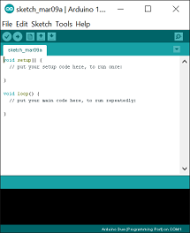
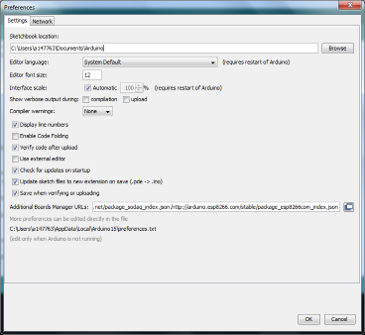
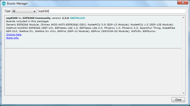
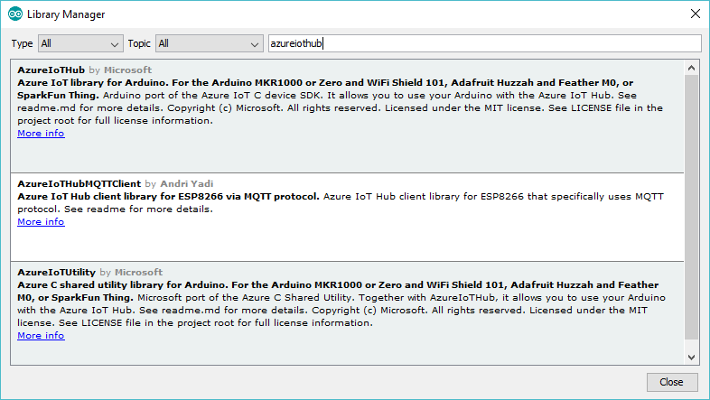
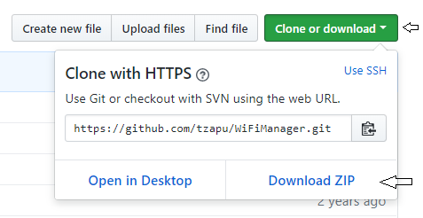
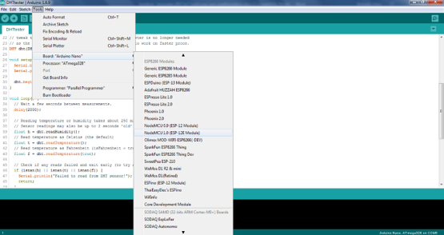
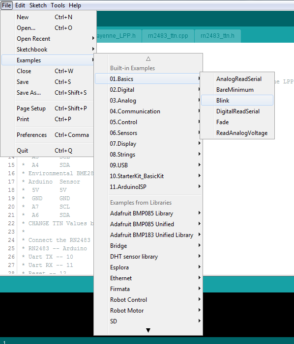

# Build-your-own-dust-meter
Workshop documentation on building your own nodeMCU based dust meter.

This Dust Sensor (Shinyei ppd42) gives a good indication of the air quality in an environment by measuring the dust concentration. The Particulate Matter level (PM level) in the air is measured by counting the Low Pulse Occupancy time (LPO time) in given time unit. LPO time is proportional to PM concentration. This sensor can provide reliable data for air purifier systems; it is responsive to PM of diameter 1μm.

**Note**

This sensor uses counting method to measure dust concentration, not weighing method, and the unit is pcs/L or pcs/0.01cf.

**Specification**

| Item                              | Norm                                                         | Unit                   |
| --------------------------------- | ------------------------------------------------------------ | ---------------------- |
| VCC                               | 4.75~5.75                                                    | V                      |
| Standby Current Supply            | 90                                                           | mA                     |
| Detectable range of concentration | 0~28,000 / 0 ~ 8000                                          | pcs/liter / pcs/0.01cf |
| Operating Temperature Range       | 0~45                                                         | °C                     |
| Output Method                     | Negative Logic, Digital output, High: over 4.0V(Rev.2), Low: under 0.7V | -                      |
| Detecting the particle diameter   | >1                                                           | μm                     |
| Dimensions                        | 59(W) × 45(H) × 22(D)                                        | mm                     |
| Humidity Range                    | 95% rh or less                                               | -                      |

## Cautions before beginning

- Please keep it upright.
- 3 min preheat time is required while using for the first time.
- Arbitrary operation may cause unexpected damage.
- The onboard potentiometers are used only for the factory setting. Please do not change the default configuration.

## Connect hardware on breadboard


- Vin to pin 3 PPD42
- GND to pin 1 PPD42
- Pin 1 PPD42 to 4,7K resistor
- 4,7K resistor to 10K resistor
- 10K resistor to GND
- Middle resistors to D7




## Prepare your laptop for ESP development
1. Install the https://www.arduino.cc/en/Main/Software Arduino IDE software (Windows installer), launch the IDE and allow firewall access
1. File > Preferences, check the “Display line numbers option“
1. Add the URL http://arduino.esp8266.com/stable/package_esp8266com_index.json to the “Addition Boards Manager URLs” field and press the “Ok” button

1. Tools > Boards > Boards Manager, install the "esp8266" board package

1. Sketch> Include Library> Manage Libraries, install the "AzureIoTHub", "AzureIoTProtocol_MQTT",  "Adafruit Unified Sensor"  and "AzureIoTUtility" libraries



6. Download the following libraries: https://github.com/tzapu/WiFiManager, http://github.com/bblanchon/ArduinoJson and https://github.com/knolleary/pubsubclient via "Clone or download" and then pressing "Download ZIP". Then load these libraries via; Sketch->Include library->Add .ZIP Library.



When Connectivity to the board does not work:
- Install the CP210x USB to UART driver and make sure you reboot your machine afterward (I suffered strange behaviors using the driver without rebooting) https://www.silabs.com/products/development-tools/software/usb-to-uart-bridge-vcp-drivers
- After rebooting open the Arduino IDE and select the proper board from Tools->Board->Board ”nodeMCU 1.0 (ESP-12E Module)”



## Test your laptop and nodeMCU setup
- Load the example sketch “Blink” into the Arduino IDE from File->Examples->01 Basics->Blink

- Try compiling it by pressing the Verify button: 

- When ok, connect the nodeMCU to your laptop:
	- 	Connect the nodeMCU with the USB cable
		 	Via Tools -> Port, check if the correct COMxx port is selected
		 	Upload the sketch by pressing the Upload button:
	
		 	Wait till the sketch is compiled and uploaded
- The blue led on the nodeMCU should now start blinking


## Test to see if the nodeMCU can measure dust
- Create a new sketch with this code and name DustMeter: (from http://wiki.seeed.cc/Grove-Dust_Sensor/)


```
/*
Grove - Dust Sensor Demo v1.0
 Interface to Shinyei Model PPD42NS Particle Sensor
 Program by Christopher Nafis
 Written April 2012

 http://www.seeedstudio.com/depot/grove-dust-sensor-p-1050.html
 http://www.sca-shinyei.com/pdf/PPD42NS.pdf

 JST Pin 1 (Black Wire)  =&gt; //NodeMCU GND
 JST Pin 3 (Red wire)    =&gt; //NodeMCU 5V DC Vin
 JST Pin 4 (Yellow wire) =&gt; //NodeMCU Digital Pin 13
 */

int pin = 13;
unsigned long duration;
unsigned long starttime;
unsigned long sampletime_ms = 2000;//sampe 30s&nbsp;;
unsigned long lowpulseoccupancy = 0;
float ratio = 0;
float concentration = 0;

void setup() {
  Serial.begin(9600);
  pinMode(pin,INPUT);
  starttime = millis();//get the current time;
}

void loop() {
  duration = pulseIn(pin, LOW);
  lowpulseoccupancy = lowpulseoccupancy+duration;

  if ((millis()-starttime) >= sampletime_ms)//if the sampel time = = 30s
  {
    ratio = lowpulseoccupancy/(sampletime_ms*10.0);  // Integer percentage 0=&gt;100
    concentration = 1.1*pow(ratio,3)-3.8*pow(ratio,2)+520*ratio+0.62; // using spec sheet curve
    Serial.print("concentration = ");
    Serial.print(concentration);
    Serial.println(" pcs/0.01cf");
    Serial.println("\n");
    lowpulseoccupancy = 0;
    starttime = millis();
  }
}
```


- Try compiling it by pressing the Verify button
- When ok:
	- 	Connect the nodeMCU with the USB cable
		 	Via Tools -> Port, check if the correct COMxx port is selected
		 	Upload the sketch by pressing the Upload button: 
		 	Wait till the sketch is compiled and uploaded
		 	Open the monitor Tools->Serial Monitor
- Message with the concentration in pcs/0.01cf (particles per 1 micron) should appear within the monitor
- Try blowing gently over the sensor, you should see other values 


## Test to see if the nodeMCU can function as a web server
- Load the example sketch “AdvancedWebServer” into the Arduino IDE from File->Examples->ESP8266WebServer
- Find the line with the *ssid and change it to the ssid given to you in the workshop
- Find the line with the *password and change it to password given to you in the workshop
- Try compiling it by pressing the Verify button 
- When ok:
	- 	Connect the nodeMCU with the USB cable
		 	Via Tools -> Port, check if the correct COMxx port is selected
		 	Upload the sketch by pressing the Upload button 
		 	Wait till the sketch is compiled and uploaded
		 	Open the monitor
- A message should be displayed with “IP address: www.xxx.yyy.zzz”
- Now connect your laptop or mobile phone to the same network as the nodeMCU is connected to
- Open the page www.xxx.yyy.zzz, you should be able to see ESP8266 message and a graph


## Advanced Extra: combine the webserver and DustMeter sketch  to display the Dust measurement from your laptop or mobile phone
- Open both the sketches “AdvancedWebServer” and “DustMeter” and find a way to combine the necessary code from DustMeter into the AdvancedWebServer examples.
- Do not forget to save it under a new name like “my_dustmeter”


## Advanced Extra 2: send DustMeter data to the Cloud

- Load the example sketch “Azure IoT Hub connectivity app” (available from GitHub)
- Adapt the sketch so it includes the necessary code to send dust measurement data (hint: message...)
- Try compiling it by pressing the Verify button 
- When ok:
  - Connect the nodeMCU with the USB cable
    Via Tools -> Port, check if the correct COMxx port is selected
     	Upload the sketch by pressing the Upload button 
     	Wait till the sketch is compiled and uploaded
     	Open the monitor
- In the monitor press y within 5 seconds (configure monitor with newline)
- Enter the provided SSID, password and connection string (will be provided during the workshop)
- Once entered the monitor will display messages on the wifi and IoTHub connection, dus concentration measured and the message that is sent
- If you want to see if the messages arrive within the Azure IoT Hub install the Device explorer from here: https://github.com/Azure/azure-iot-sdk-csharp/tree/master/tools/DeviceExplorer Ask the workshop presenter to provide for the needed IoT Hub connection string. Once connected you can see the incoming data from the Data TAB.


- Now go to the dashboard ***<Link HERE>*** to see if your data is presented within the cloud


## Case for outside measurement

Build yourself: http://meetjestad.net/meten/files/bouwinstructie.pdf
Buy: https://www.weerstationkopen.nl/accessoires-weerstations/tfa/98111402-tfa-sensorhut

## Learning IoT and Azure IoT

*Links to training and information*
